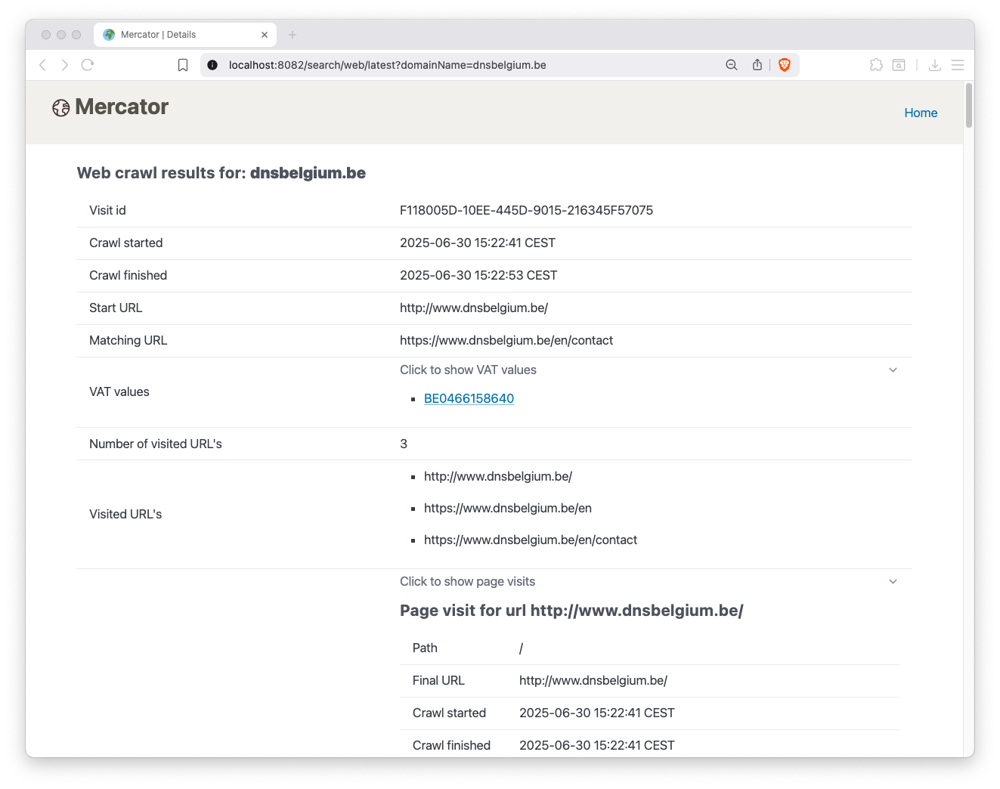

[](https://github.com/DNSBelgium/mercator/actions/workflows/junit-report.yml)

[](https://github.com/DNSBelgium/mercator/actions/workflows/snyk.yml)

# Intro

Mercator is a crawler with one major design goal: **ease of use**

# Features

* Zero required dependencies (no Postgres needed, no Kubernetes, no Kafka, no nothing)
* Can be run as a single docker image
* Crawl results are saved in parquet files, using [duckdb](https://duckdb.org/)
* Can optionally save the parquet files on Amazon S3
* Multi-platform docker images published to docker hub (x86 and aarch64) => also works an Apple Silicon machines

# Running Mercator (using docker)

Mercator can be run in two modes:
* batch: in this mode, Mercator will process an input file with domain names and exit when done
* UI: in this mode, Mercator will provide a web interface to consult the crawl results obtained by running mercator in batch mode.

## Running Mercator in batch mode  

To run Mercator in batch mode, you need the following
* a (mounted) folder where Mercator can write the crawl results
* a csv file with domain names: each line should contain an uuid and a domain name, separated by a comma
* optionally: a file with your custom settings
* optionally: a MaxMind license key for GEO IP enrichment 
* a working docker environment

### For example:

Create a new folder and make it your working directory:
```shell
cd $(mktemp -d)
```

Create the csv file:
```shell 
echo -n "$(uuidgen),dnsbelgium.be\n$(uuidgen),abc.be\n" > input.csv
```

Create a file with your custom settings:
```shell
cat <<EOF > env
SPRING_PROFILES_ACTIVE=batch

# set to true if you have a MaxMind license key
CRAWLER_DNS_GEOIP_ENABLED=false
MAXMIND_LICENSE_KEY=replace_with_your_key_if_you_have_one

# We disable SMTP crawling for now since it is blocked on many networks 
JOB_SMTP_ENABLED=false

EOF
```

Now run Mercator:

```shell
docker pull dnsbelgium/mercator

docker run --env-file env -v $(pwd):/root/mercator --rm dnsbelgium/mercator
```

Mercator will a `json` and a `data` directory inside the mounted folder. When Mercator is finished, you can consult the resulting parquet files.

## Consulting the crawl results:

The crawl results are saved in parquet files and can be consulted with any tool that supports parquet: pandas, Polars, Apache Spark, Apache Trino, Amazon Athena, DuckDB, ...

```shell
find data -type f 
```

Consulting the crawl results with DuckDB:
```shell
# install duckdb
curl https://install.duckdb.org | sh

cat <<EOF > web.sql
.mode markdown

with page_visits as (
  select domain_name, unnest(page_visits) as page_visit
  from read_parquet('data/web/**/*.parquet')
  ),
  web_data as (
     select domain_name, page_visit.html_features as html_features, page_visit
     from page_visits
  )
select domain_name, page_visit.url, page_visit.detected_technologies, page_visit.html_features.title, page_visit.html_features.facebook_links
   -- , page_visit.* , html_features.*
from web_data
EOF

duckdb < web.sql
```

The output should look like this:

| domain_name   | url                                                | detected_technologies                                                                                     | title                                       | facebook_links                              |
|---------------|----------------------------------------------------|-----------------------------------------------------------------------------------------------------------|---------------------------------------------|---------------------------------------------|
| dnsbelgium.be | http://www.dnsbelgium.be/                          | [Imperva, Google Tag Manager, HSTS, PWA, Google Font API, Cookiebot, Open Graph]                          | Registry for .be, .brussels and .vlaanderen | \[\]                                        |
| dnsbelgium.be | https://www.dnsbelgium.be/en                       | [Imperva, Google Tag Manager, HSTS, PWA, Element UI, Google Font API, Cookiebot, Open Graph]              | Registry for .be, .brussels and .vlaanderen | \[ 'https://www.facebook.com/DNSBelgium' \] |
| dnsbelgium.be | https://www.dnsbelgium.be/en/contact               | [Google Maps, Imperva, Google Tag Manager, HSTS, PWA, Element UI, Google Font API, Cookiebot, Open Graph] | Contact                                     | \[ 'https://www.facebook.com/DNSBelgium' \] |
| dnsbelgium.be | https://www.dnsbelgium.be/robots.txt               | []                                                                                                        | NULL                                        | NULL                                        |
| dnsbelgium.be | https://www.dnsbelgium.be/.well-known/security.txt | []                                                                                                        | NULL                                        | NULL                                        |
| abc.be        | http://www.abc.be/                                 | [Nginx, jQuery, jsDelivr, PHP, Bootstrap, jQuery Migrate, Joomla, Google Font API]                        | Home                                        | \[\]                                        |
| abc.be        | http://www.abc.be/en/contact-english.html          | [Nginx, jQuery, jsDelivr, PHP, Bootstrap, jQuery Migrate, Joomla, Google Font API]                        | Contact us                                  | \[\]                                        |
| abc.be        | https://www.abc.be/robots.txt                      | []                                                                                                        | NULL                                        | NULL                                        |
| abc.be        | https://www.abc.be/.well-known/security.txt        | []                                                                                                        | NULL                                        | NULL                                        |


We have limited the query above to a few fields of the web module. Mercator collects way more data than this. Uncomment the line starting with -- to see all columns collected by the web module.

## Running the Mercator Web User interface

To consult the crawl results in the browser, you should run Mercator in WEB mode:

Optional: create a file with your custom settings
```shell
cat <<EOF > web_mode
 # add any custom settings here
EOF
```

Start the container:
```shell
docker run docker run --env-file web_mode -v $(pwd):/root/mercator -p 8082:8082 dnsbelgium/mercator
```

Or to start the container in the background (and give it a name):
```shell
docker run docker run --name mercator-web --detach --env-file web_mode -v $(pwd):/root/mercator -p 8082:8082 --rm dnsbelgium/mercator
```

You can now visit http://localhost:8082/ in the browser and look up one of the crawl results, for example http://localhost:8082/search/web/latest?domainName=dnsbelgium.be
Which should look like this:




Stop the container:
```shell
docker stop mercator-web
```

# Settings

The behaviour of Mercator can be tweaked by setting various properties.
Mercator uses [https://docs.spring.io/spring-boot/reference/features/external-config.html](https://docs.spring.io/spring-boot/reference/features/external-config.html)
which means you can change properties in several ways. 
To easiest way is probably to set environment variables when starting the Mercator container.

See [docs/mercator_settings.MD](docs/mercator_settings.MD) for an overview of all configurable properties with their goal, data type and default value.

# Logging

## File output

By default, Mercator writes logging events to disk in JSON format to this file: ${HOME}/mercator/mercator.log.json
More specifically, it uses Graylog Extended Log Format (GELF).
The log file will be rotated (and compressed) when it reaches 10MB. A maximum of 7 rotated files will be kept.

You can consult the JSON file(s) with your favorite tool. 
For example, with duckdb:

```sql 
select to_timestamp(timestamp) as ts, _level_name, short_message 
from read_json('mercator.log.json*', union_by_name=true)
order by ts
```
You can control the defaults with these properties:
* LOGBACK_ROLLINGPOLICY_MAX_FILE_SIZE
* LOGBACK_ROLLINGPOLICY_MAX_HISTORY
* LOGBACK_ROLLINGPOLICY_FILE_NAME_PATTERN

For more details, see the [Spring Boot documentation](https://docs.spring.io/spring-boot/reference/features/logging.html#features.logging.file-rotation)

## Console output

Mercator also writes log events to the console, but this output is throttled for performance reasons. 
See [src/main/resources/logback-spring.xml](src/main/resources/logback-spring.xml)

# Compiling & running locally 

## If you have no (recent) JDK on your system

```bash
curl -s "https://get.sdkman.io" | bash
sdk install java 23.0.2-tem
sdk install maven 3.9.10 
```

## Compiling

```
mvn package
```
=> This will compile the sources, run all (enabled) tests and check for vulnerabilities. To run the tests, you need a Docker environment.

To run without tests and vulnerability scanning, use:
```bash
mvn package -DskipTests -Dsnyk.skip
```

## Running locally compiled version

```
mvn spring-boot:run
```

To use a specific profile: 
```
mvn spring-boot:run -Dspring-boot.run.profiles=local
```

>[!NOTE]
> Using the 'local' profile will start mercator on port 8090 instead of 8082.

## Running the JAR file
```
java -jar -Dspring.active.profiles=local  target/mercator-*-SNAPSHOT.jar
```

>[!NOTE]
> You need to run `mvn package` first.
> 

## Running duckdb commands

Sometimes you want to set up some duckdb stuff before you run Mercator batch or frontend.
E.g. create a persistent secret or install extensions.

You can do this by running the application with `duckdb` as first argument

```shell
# build the application
mvn clean package -DskipTests -Dsnyk.skip=true\n

# run sql script from file
#java -jar $(find target -name '*.jar') duckdb < install.sql

# run ad hoc queries
echo "select 'bar' as foo" | java -jar $(find target -name '*.jar') duckdb
# install extensions
echo "install aws; install httpfs;" | java -jar $(find target -name '*.jar') duckdb
# create s3 secret
echo "create or replace persistent secret (type s3, provider credential_chain)" | java -jar $(find target -name '*.jar') duckdb
```

# Running with docker compose

Build container image and publish to local docker daemon:
```
mvn -D jib.to.image=dnsbelgium/mercator jib:dockerBuild
```

* Store a username in ~/.env.grafana-username
* Store a password in ~/.env.grafana-password

```
cd ./observability
docker-compose up --renew-anon-volumes --remove-orphans -d
docker compose logs mercator 
```

The Mercator UI should be available at http://localhost:8082

Metrics are available on http://localhost:3000 


# Running mercator GUI

```shell
docker run \
  -v $(pwd):/root/mercator \
  -p 8082:8082 \
  --rm \
  dnsbelgium/mercator
  
open http://localhost:8082
```
# Features
  
Mercator will do the following info for each submitted domain name
* Fetch a configurable set of DNS resource records (SOA, A, AAAA, NS, MX, TXT, CAA, HTTPS, SVCB, DS, DNSKEY, CDNSKEY, CDS, ...)
* Fetch one or more html pages
* Searches for (Belgian) VAT numbers
* Extract features from all collected html pages
* Record conversations with all configured SMTP servers
* Check the TLS versions (and cipher suites) supported on port 443
Other features:
* Basic Web UI to consult the crawl results
* Publishes metrics for Prometheus
* docker-compose file to start Prometheus & [Grafana](http://localhost:3000)  
  * with custom Grafana dashboards with the most important metrics

# Planned features
* support for finding non-Belgian VAT numbers on the visited websites 