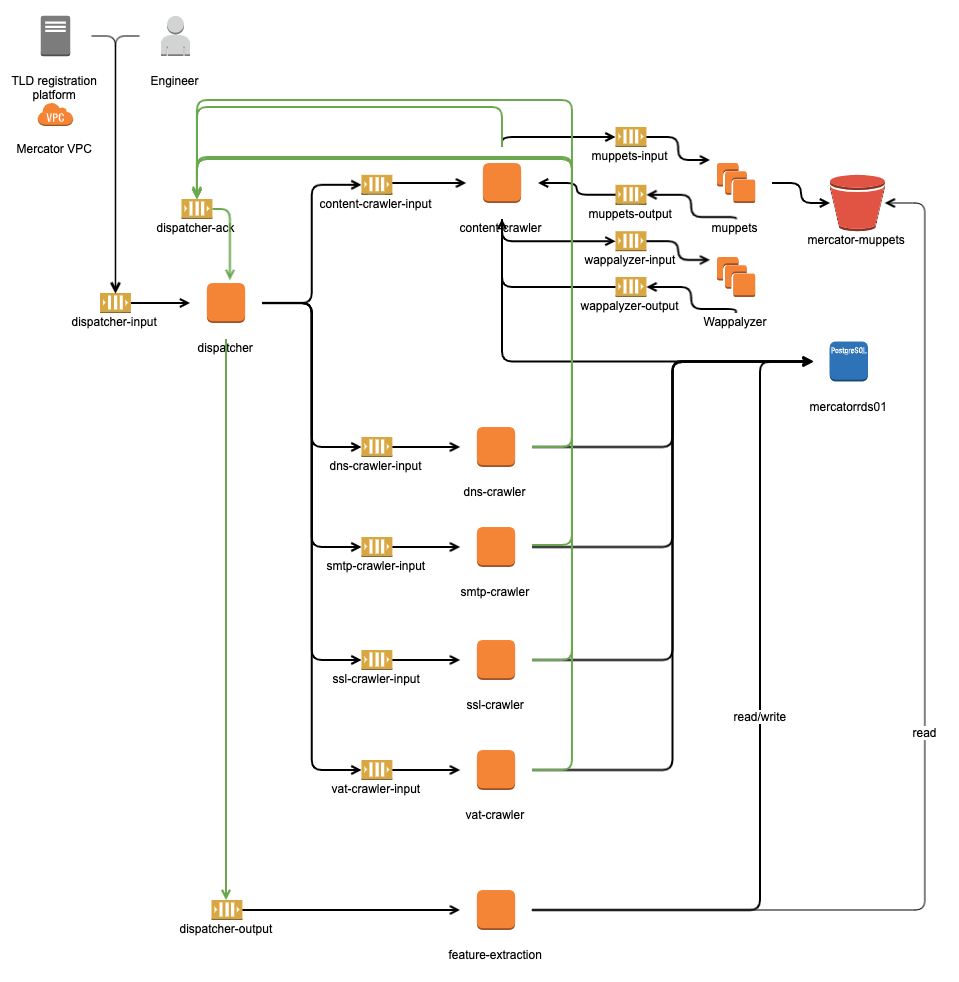

# Mercator

[Mercator](https://en.wikipedia.org/wiki/Gerardus_Mercator) was a Belgian geographer, but it is also DNS Belgium's
crawler project.

Given a domain name, Mercator gathers public information from different sources: HTML, DNS records, SMTP servers, SSL Certificates,
etc.

## Architecture

## Goals

The architecture is optimized to induce following properties in the system:

* **performance**: we want to be able to crawl our zone (.be: ~1.7 million domain names) within a few days, with a cost
  that is comparable to existing crawlers for similar features
* **scalability**: we want to be able to deploy the crawler in at least two ways: 'listening mode', which reacts to
  domain events of the registration platform like new registrations (~1 visit/minute, optimized for lead time), and '
  batch mode', which crawls the entire zone in minimal time (~1 full crawl/month, which should gain a speed of ~1000
  visits/minute to crawl the zone within a day, optimize for throughput). We don't want to pay all the time for our peak
  usage.
* **extensibility**: introducing new components should not disrupt the working of other components. We don't need this
  during runtime, we can afford to take the system offline for upgrades. A second part of extensibility is that we want
  to be able to share the code with other registries, which implies that we shouldn't have .be-specific code in this
  repository. And thus we have a need to be able to add behaviour to the system from multiple code bases.
* **robustness**: more in the design than the architecture viewpoint. The internet is a wild place. Be aware that you'll
  encounter situations you would not think possible out there. Individual components should be able to handle them. On
  an architectural level, we don't think there is a need to support more than usual robustness against missing or broken
  components of the crawler, as long as the system is extensible.
* **observability**: If things go wrong, both functionally and performance-wise, we want to quickly locate problematic
  points

### Model

The current architectural model is service-oriented, networked and event-driven. Multiple modules act on their own
interests. The primary communication between modules happens by posting events on a shared message bus. Other modules
can react to these events in their own processing and as a result announce new events.

The contract between modules is thus mostly defined by events and the structure of the data in events. Modules should
clearly show what events they publish. We do this in two ways. First is by naming convention: all events (and only
events) should have class names ending in 'Event'. Second is by packaging conventions: all events (and only events)
should be together in an 'events' package, somewhere in the module's hierarchy. Possible non-Java apps should adopt
guidelines that create similar advantages.

The end goal of a crawler is to collect data, so all crawl results are written into a shared datastore, which allows
easier manual consumption of the data. Each module has its own schema. Over time, we should make clear distinctions
between temporary, internal module state and stable, consumable data.

### Subprojects

* `content-crawler` (Java / Spring Boot): Content-related crawling. Interacts over SQS with muppets to fetch and
  retrieve content. Stores the links to relevant S3 files in the DB
* `dispatcher` (Java / Spring Boot): Spring Boot app that serves as API entrypoint to the crawler system and will copy
  messages to the input queues of all modules that need it.
* `dns-crawler` (Java / Spring Boot): DNS-related crawling. Fetch DNS records, post-process with geo-ip.
* `feature-extraction`(Java / Spring Boot): extracts features from data collected by other modules. For now only
  extracts features from the HTML.
* `ground-truth`(Java / Spring Boot): Ground-truth only creates tables for labeling the mercator visits.
* `mercator-api` (Java / Spring Boot): Expose API via Spring Data REST, using the JPA entities of other modules.
* `mercator-ui` (NodeJS / TypeScript / React): Basic UI for Mercator
* `mercator-wappalyzer` (NodeJS / TypeScript): Wrapper around [Wappalyzer](https://github.com/AliasIO/wappalyzer), using
  to detect technologies in websites.
* `muppets` (NodeJS / TypeScript): Takes screenshots via puppeteer, interacts over SQS and stores results in S3
* `observability`: code to support the observability property of the system
* `smtp-crawler` (Java / Spring Boot): Stores information about SMTP servers.
* `tls-crawler` (Java / Spring Boot): Gather SSL certificates and extracts data.
* `vat-crawler` (Java / Spring Boot): Try to find VAT number (belgian only for now) on a website.
* `mercator-cli` (Java / Spring Boot): Command-line interface to interact with the SQS queues of the different modules.

### Data Model

All modules currently write into a PostgreSQL database.
See [Data Catalog](https://github.com/DNSBelgium/mercator/blob/main/doc/data_catalog.md) for more details.

### Warning on usage

Be aware that running Mercator might trigger some alarms to the crawled domains' servers.
Some modules open a lot of parallel connections and might be seen as scanning tool or even DoS attack.
We plan to implement rate-limits and/or cache-lookups when that is possible.
Keep that in mind when changing configuration values such as timeouts, ratelimits, max value for Horizontal Pod Autoscaling (HPA), etc.

DNS Belgium is not responsible for any complaints you could receive in the result of using Mercator.

## Requirements

* Java 11
* Docker & Docker Compose
* Helm

Builds with gradle, bundled as gradle wrapper. Uses Spring Boot and Spring Cloud AWS/SQS/Spring messaging/Spring JMS.

We currently use [LocalStack](https://github.com/localstack/localstack) locally and AWS SQS in the cloud for cloud
stream implementation, and Postgres as data store implementation.

### Maxmind GeoIP license

In order to use the Geo IP capacity in the crawler, you need to register and generate a key
at [Maxmind](https://support.maxmind.com/hc/en-us/articles/4407111582235-Generate-a-License-Key). You can then enable
GeoIP in `dns-crawler` and `smtp-crawler` and put you license key there. (see properties files).

## Usage

Run `start-all.sh` to start the entire system using docker-compose.

## Crawling

Once all services are running, start a crawl by sending a message to the dispatcher input queue:

    aws --endpoint-url=http://localhost:4566 sqs send-message --queue-url http://localhost:4566/queue/mercator-dispatcher-input --message-body '{"domainName": "abc.be"}'

or if you want a label, use

    aws --endpoint-url=http://localhost:4566 sqs send-message --queue-url http://localhost:4566/queue/mercator-dispatcher-input --message-body '{"domainName": "abc.be", "labels": ["some-label"]}'

After some time, results should start appearing in the database. You can surf to
http://localhost:5050/?pgsql=db&username=postgres&db=postgres to inspect the database using the bundled database viewer.

It's best to *always* go via the Dispatcher. But if you really want to, you can send a message directly to the input
queue of a single module. You have to add a valid visit_id in that case:

    aws --endpoint-url=http://localhost:4566 sqs send-message --queue-url http://localhost:4566/queue/mercator-content-crawler-input --message-body '{"visitId":"f1c25d2f-3248-4013-a73a-307f91ee014b", "domainName": "abc.be"}'

Or

    aws --endpoint-url=http://localhost:4566 sqs send-message --queue-url http://localhost:4566/queue/mercator-dns-crawler-input --message-body '{"visitId":"f1c25d2f-3248-4013-a73a-307f91ee014a", "domainName": "abc.be"}'

## Development

For local development, it makes more sense to run our services outside the docker network, directly on our machine.

Run `start-deps.sh` to start only the dependencies.

Use the 'local' profile to start individual components.

The local profile (Spring) or the local env (ssl-crawler) by default uses the following ports

* 8082 : DNS crawler
* 8083 : SMTP crawler
* 8084 : content crawler
* 8085 : muppets
* 8086 : dispatcher
* 8087 : wappalyzer
* 8088 : feature-extraction
* 8089 : mercator-api
* 8090 : mercator-ui
* 8091 : vat-crawler
* 8092 : ground-truth
* 8093 : ssl-crawler

Or use intellij to run/debug one of the Application classes. Do not forget to specify the local profile in this case.

- Prometheus : http://localhost:9090
- Grafana: http://localhost:3000 (admin/admin)

## Deployment

Mercator's goal is to run on Kubernetes. This allows to scale modules of mercator easily and according to the load.

### Build containers

The build of the containers for the Spring Boot apps is done using [jib](https://github.com/GoogleContainerTools/jib).
The other modules uses Docker cli to build the container.

Each module has a gradle task `dockerBuild` that will create the docker container.

### Helm charts

Each module has its own Helm charts. We use Helm to deploy the app in Kubernetes.

### Local Kubernetes

It is possible to locally create a Kubernetes cluster with `docker-desktop`

### Infrastructure as code

Infrastructure as code is stored in another git repo.

### setup Prometheus and grafana

TODO

## Contributing

If you are interested in contributing to Mercator:

- Start by reading our [contributing guide](CONTRIBUTING.md).
- Navigate our codebase and [open issues](https://github.com/dnsbelgium/mercator/issues).

We are thankful for all the contributions and feedback we receive.

### Contributors

This tool is initially developed by [DNS Belgium](https://dnsbelgium.be).

## License

This version of Mercator is released under the Apache License, Version 2.0 (see LICENSE.txt).

