# Service catalog : Mercator Data Catalog

* [Intro](#MercatorDataCatalog-Intro)
* [Content crawler](#MercatorDataCatalog-Contentcrawler)
* [DNS crawler](#MercatorDataCatalog-DNScrawler)
    * [dns\_crawl\_result](#MercatorDataCatalog-dns_crawl_result)
    * [dns\_crawl\_result\_geo\_ips](#MercatorDataCatalog-dns_crawl_result_geo_ips)
* [SMTP crawler](#MercatorDataCatalog-SMTPcrawler)
* [SSL crawler](#MercatorDataCatalog-SSLcrawler)
    * [ssl\_crawl\_result](#MercatorDataCatalog-ssl_crawl_result)
    * [certificate](#MercatorDataCatalog-certificate)
    * [certificate\_deployment](#MercatorDataCatalog-certificate_deployment)
    * [trust\_store](#MercatorDataCatalog-trust_store)
    * [check\_against\_trust\_store](#MercatorDataCatalog-check_against_trust_store)
    * [curve](#MercatorDataCatalog-curve)
    * [curve\_support](#MercatorDataCatalog-curve_support)
    * [cipher\_suite](#MercatorDataCatalog-cipher_suite)
    * [cipher\_suite\_support](#MercatorDataCatalog-cipher_suite_support)
* [Feature extraction](#MercatorDataCatalog-Featureextraction)
    * [html\_features](#MercatorDataCatalog-html_features)
* [Dispatcher](#MercatorDataCatalog-Dispatcher)
    * [dispatcher\_event](#MercatorDataCatalog-dispatcher_event)
    * [dispatcher\_event\_acks](#MercatorDataCatalog-dispatcher_event_acks)
    * [dispatcher\_event\_labels](#MercatorDataCatalog-dispatcher_event_labels)

## Intro

This page contains an overview of the data that Mercator collects and stores in the database (or in other locations),
and a brief description of all the columns.

The data is grouped by Mercator module.

## Content crawler

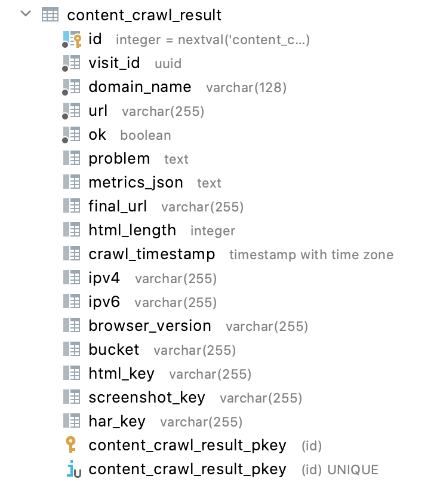

| Column name     | Description                                                                                                                | Example                                                                                                                                                                                                                                                                                                                                                                                                                                          |
|-----------------|----------------------------------------------------------------------------------------------------------------------------|--------------------------------------------------------------------------------------------------------------------------------------------------------------------------------------------------------------------------------------------------------------------------------------------------------------------------------------------------------------------------------------------------------------------------------------------------|
| id              | primary key                                                                                                                | 12946485                                                                                                                                                                                                                                                                                                                                                                                                                                         |
| visit_id        | Unique id (UUID) per visit. All modules share the same visit_id, so it can be used to collect all data of 1 specific visit | bcd90704-2f51-40e2-9c52-101dceca168e                                                                                                                                                                                                                                                                                                                                                                                                             |
| domain_name     | The crawled domain name                                                                                                    | dnsbelgium.be                                                                                                                                                                                                                                                                                                                                                                                                                                    |
| metrics_json    | Metrics of Chrome browser, see https://github.com/puppeteer/puppeteer/blob/main/docs/api.md#pagemetrics                    | <pre>{<br/>    "Timestamp": 623028.365859,<br/>    "Documents": 6,<br/>    "Frames": 1,<br/>    "JSEventListeners": 100,<br/>    "Nodes": 1815,<br/>    "LayoutCount": 17,<br/>    "RecalcStyleCount": 41,<br/>    "LayoutDuration": 0.218586,<br/>    "RecalcStyleDuration": 0.191583,<br/>    "ScriptDuration": 1.385864,<br/>    "TaskDuration": 2.57944,<br/>    "JSHeapUsedSize": 16548584,<br/>    "JSHeapTotalSize": 22495232<br/>}</pre> |
| url             | The url that was crawled (the input for chrome)                                                                            | http://www.dnsbelgium.be                                                                                                                                                                                                                                                                                                                                                                                                                         |
| ok              | Boolean die aangeeft of de crawl gelukt is                                                                                 | true                                                                                                                                                                                                                                                                                                                                                                                                                                             |
| problem         | Error message if the crawl is unsuccessful                                                                                 | null                                                                                                                                                                                                                                                                                                                                                                                                                                             |
| final_url       | Where the browser ended up (after following redirects)                                                                     | https://www.dnsbelgium.be/en                                                                                                                                                                                                                                                                                                                                                                                                                     |
| html_length     | Size of the fetched html in number of bytes                                                                                | 91211                                                                                                                                                                                                                                                                                                                                                                                                                                            |
| crawl_timestamp | Time when crawl happened.                                                                                                  | 2022-01-07 08:57:30.817246 +00:00                                                                                                                                                                                                                                                                                                                                                                                                                |
| ipv4            | IPv4 address from where we performed the crawl. Will be null for a crawl over IPv6(so not the IP of the website)           | 123.45.67.89                                                                                                                                                                                                                                                                                                                                                                                                                                     |
| ipv6            | IPv6 address from where we performed the crawl. Currently always null since we only crawl over IPv4.                       | null                                                                                                                                                                                                                                                                                                                                                                                                                                             |
| browser_version | The version of the browser that was used for the crawl                                                                     | HeadlessChrome/97.0.4692.71                                                                                                                                                                                                                                                                                                                                                                                                                      |
| bucket          | Name of S3 bucket where screenshot and other files were saved                                                              | prod-mercator-muppets                                                                                                                                                                                                                                                                                                                                                                                                                            |
| html_key        | S3 prefix (key) of the html file                                                                                           | `dnsbelgium.be/2022/01/07/http/www.dnsbelgium.be/index.html/b6482517-77bd-4d6d-8bd4-2f2990ca6da5/index.html`                                                                                                                                                                                                                                                                                                                                     |
| screenshot_key  | S3 prefix (key) of the screenshot file                                                                                     | `dnsbelgium.be/2022/01/07/http/www.dnsbelgium.be/index.html/b6482517-77bd-4d6d-8bd4-2f2990ca6da5/screenshot.png`                                                                                                                                                                                                                                                                                                                                 |
| har_key         | S3 prefix (key) of the HAR file                                                                                            | `dnsbelgium.be/2022/01/07/http/www.dnsbelgium.be/index.html/b6482517-77bd-4d6d-8bd4-2f2990ca6da5/www.dnsbelgium.be.har`                                                                                                                                                                                                                                                                                                                          |

## Mercator-wappalyzer

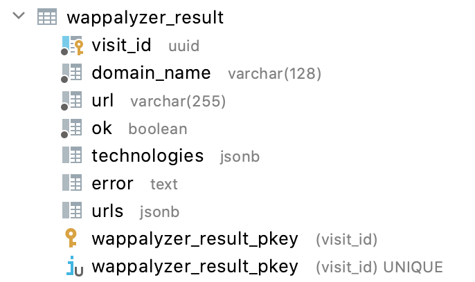

| Column name     | Description                                                                  | Example                                                                                                                                                                                                                                                                                                                                                                                                                                                                                                                                                        |
|-----------------|------------------------------------------------------------------------------|----------------------------------------------------------------------------------------------------------------------------------------------------------------------------------------------------------------------------------------------------------------------------------------------------------------------------------------------------------------------------------------------------------------------------------------------------------------------------------------------------------------------------------------------------------------|
| visit_id        | Unique id (UUID) per visit. All modules share the same visit_id. primary key | bcd90704-2f51-40e2-9c52-101dceca168e                                                                                                                                                                                                                                                                                                                                                                                                                                                                                                                           |
| domain_name     | The crawled domain name                                                      | dnsbelgium.be                                                                                                                                                                                                                                                                                                                                                                                                                                                                                                                                                  |
| url             | The url that was crawled (the input for chrome)                              | http://www.dnsbelgium.be                                                                                                                                                                                                                                                                                                                                                                                                                                                                                                                                       |
| ok              | Boolean indicating whether the crawl was successful                          | true                                                                                                                                                                                                                                                                                                                                                                                                                                                                                                                                                           |
| technologies    | JSON with all the technologies found by wappalyzer.                          | See below                                                                                                                                                                                                                                                                                                                                                                                                                                                                                                                                                      |
| error           | Error message if the crawl is unsuccessful                                   | null                                                                                                                                                                                                                                                                                                                                                                                                                                                                                                                                                           |
| urls            | Details per URL visited.                                                     | <pre>{<br/>    "http://www.dnsbelgium.be/": {<br/>        "error": null,<br/>        "status": 301<br/>    },<br/>    "https://www.dnsbelgium.be/": {<br/>        "error": null,<br/>        "status": 200<br/>    },<br/>    "https://www.dnsbelgium.be/en": {<br/>        "error": null,<br/>        "status": 200<br/>    },<br/>    "https://www.dnsbelgium.be/fr": {<br/>        "error": null,<br/>        "status": 200<br/>    },<br/>    "https://www.dnsbelgium.be/nl": {<br/>        "error": null,<br/>        "status": 200<br/>    }<br/>}</pre> |

### Technologies

For each technology found, we have the following fields. These fields (and their associated values) come
from [https://github.com/AliasIO/wappalyzer](https://github.com/AliasIO/wappalyzer)  
Not all fields have a clear definition. So the following is our best guess.

| Field      | Description                                                                                                                                                                                                                                                                                                                                                                                                                                                                                 |
|------------|---------------------------------------------------------------------------------------------------------------------------------------------------------------------------------------------------------------------------------------------------------------------------------------------------------------------------------------------------------------------------------------------------------------------------------------------------------------------------------------------|
| cpe        | The [CPE](https://cpe.mitre.org/about/) is a structured naming scheme for applications, see the [specification](https://cpe.mitre.org/specification/).                                                                                                                                                                                                                                                                                                                                      |
| icon       | application icon filename. The icon files can be found in [https://github.com/AliasIO/wappalyzer/tree/master/src/drivers/webextension/images/icons](https://github.com/AliasIO/wappalyzer/tree/master/src/drivers/webextension/images/icons) <br/>For example: [https://github.com/AliasIO/wappalyzer/blob/master/src/drivers/webextension/images/icons/WordPress.svg](https://github.com/AliasIO/wappalyzer/blob/master/src/drivers/webextension/images/icons/WordPress.svg)               |
| name       | Technology name                                                                                                                                                                                                                                                                                                                                                                                                                                                                             |
| slug       | an edit of the `name` field so that it can be used in URLs (always lowercase and without spaces)                                                                                                                                                                                                                                                                                                                                                                                            |
| version    | The detected version of the found technology.                                                                                                                                                                                                                                                                                                                                                                                                                                               |
| website    | URL of the application's website                                                                                                                                                                                                                                                                                                                                                                                                                                                            |
| confidence | a number between 0 and 100 that indicates how confident wappalyzer is about the found technology, the higher the more confident.                                                                                                                                                                                                                                                                                                                                                            |
| categories | an array of categories to which the technology belongs (according to Wappalyzer) <br/> For each category, you have the following fields: <br/><ul><li>id: an id assigned by Wappalyzer for the category (see [https://github.com/aliasio/wappalyzer/blob/master/src/technologies.json](https://github.com/aliasio/wappalyzer/blob/master/src/technologies.json)) </li><li>name: the name of the category</li><li>slug: an edit of the "name" field so that it can be used in URLs</li></ul> |

You can find a short description of technologies with the following
link [https://www.wappalyzer.com/technologies/](https://www.wappalyzer.com/technologies/${categorySlug}/${slug}/ (fill
in the category and the slug)
For
example:  [https://www.wappalyzer.com/technologies/cms/wordpress/](https://www.wappalyzer.com/technologies/cms/wordpress/)

```json
[
  {
    "cpe": null,
    "icon": "TypeScript.svg",
    "name": "TypeScript",
    "slug": "typescript",
    "version": null,
    "website": "https://www.typescriptlang.org",
    "categories": [
      {
        "id": 27,
        "name": "Programming languages",
        "slug": "programming-languages"
      }
    ],
    "confidence": 100
  },
  {
    "cpe": "cpe:/a:getbootstrap:bootstrap",
    "icon": "Bootstrap.svg",
    "name": "Bootstrap",
    "slug": "bootstrap",
    "version": null,
    "website": "https://getbootstrap.com",
    "categories": [
      {
        "id": 66,
        "name": "UI frameworks",
        "slug": "ui-frameworks"
      }
    ],
    "confidence": 100
  },
  {
    "cpe": null,
    "icon": "default.svg",
    "name": "Zone.js",
    "slug": "zone-js",
    "version": null,
    "website": "https://github.com/angular/angular/tree/master/packages/zone.js",
    "categories": [
      {
        "id": 12,
        "name": "JavaScript frameworks",
        "slug": "javascript-frameworks"
      }
    ],
    "confidence": 100
  },
  {
    "cpe": "cpe:/a:angularjs:angular.js",
    "icon": "Angular.svg",
    "name": "Angular",
    "slug": "angular",
    "version": "10.0.8",
    "website": "https://angular.io",
    "categories": [
      {
        "id": 12,
        "name": "JavaScript frameworks",
        "slug": "javascript-frameworks"
      }
    ],
    "confidence": 100
  },
  {
    "cpe": "cpe:/a:facebook:react",
    "icon": "React.png",
    "name": "React",
    "slug": "react",
    "version": null,
    "website": "https://reactjs.org",
    "categories": [
      {
        "id": 12,
        "name": "JavaScript frameworks",
        "slug": "javascript-frameworks"
      }
    ],
    "confidence": 100
  },
  {
    "cpe": "cpe:/a:nginx:nginx",
    "icon": "Nginx.svg",
    "name": "Nginx",
    "slug": "nginx",
    "version": null,
    "website": "http://nginx.org/en",
    "categories": [
      {
        "id": 22,
        "name": "Web servers",
        "slug": "web-servers"
      },
      {
        "id": 64,
        "name": "Reverse proxies",
        "slug": "reverse-proxies"
      }
    ],
    "confidence": 100
  },
  {
    "cpe": null,
    "icon": "webpack.svg",
    "name": "webpack",
    "slug": "webpack",
    "version": null,
    "website": "https://webpack.js.org/",
    "categories": [
      {
        "id": 19,
        "name": "Miscellaneous",
        "slug": "miscellaneous"
      }
    ],
    "confidence": 100
  },
  {
    "cpe": null,
    "icon": "Facebook.svg",
    "name": "Facebook",
    "slug": "facebook",
    "version": null,
    "website": "http://facebook.com",
    "categories": [
      {
        "id": 5,
        "name": "Widgets",
        "slug": "widgets"
      }
    ],
    "confidence": 100
  },
  {
    "cpe": null,
    "icon": "Google Tag Manager.svg",
    "name": "Google Tag Manager",
    "slug": "google-tag-manager",
    "version": null,
    "website": "http://www.google.com/tagmanager",
    "categories": [
      {
        "id": 42,
        "name": "Tag managers",
        "slug": "tag-managers"
      }
    ],
    "confidence": 100
  },
  {
    "cpe": null,
    "icon": "Facebook.svg",
    "name": "Facebook Pixel",
    "slug": "facebook-pixel",
    "version": "2.9.48",
    "website": "http://facebook.com",
    "categories": [
      {
        "id": 10,
        "name": "Analytics",
        "slug": "analytics"
      }
    ],
    "confidence": 100
  },
  {
    "cpe": null,
    "icon": "default.svg",
    "name": "core-js",
    "slug": "core-js",
    "version": "3.16.1",
    "website": "https://github.com/zloirock/core-js",
    "categories": [
      {
        "id": 59,
        "name": "JavaScript libraries",
        "slug": "javascript-libraries"
      }
    ],
    "confidence": 100
  },
  {
    "cpe": null,
    "icon": "Imperva.svg",
    "name": "Imperva",
    "slug": "imperva",
    "version": null,
    "website": "https://www.imperva.com/",
    "categories": [
      {
        "id": 16,
        "name": "Security",
        "slug": "security"
      }
    ],
    "confidence": 100
  }
]
```

## DNS crawler

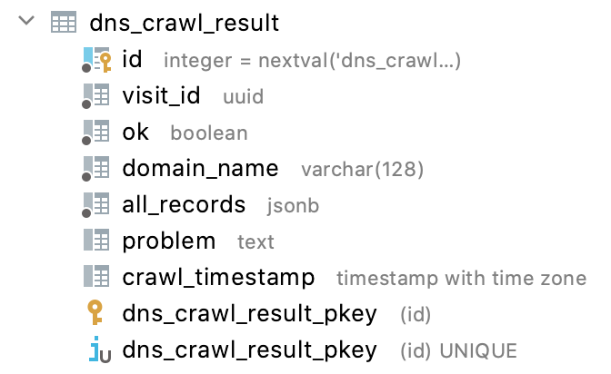

| Column name       | Description                                                                  | Example                                                                                                                                                                                                                                                                                                                                                                                                                                                                                                                                                                                                                                                                                                                                                                                                                                                                                                                                                                                                                                                                                                                                                                                                                                                                                                                                                                                                                                                                                                                                                                                                                                                                                                                                                                                                                                                                                                                                                                                                                                                                      |
|-------------------|------------------------------------------------------------------------------|------------------------------------------------------------------------------------------------------------------------------------------------------------------------------------------------------------------------------------------------------------------------------------------------------------------------------------------------------------------------------------------------------------------------------------------------------------------------------------------------------------------------------------------------------------------------------------------------------------------------------------------------------------------------------------------------------------------------------------------------------------------------------------------------------------------------------------------------------------------------------------------------------------------------------------------------------------------------------------------------------------------------------------------------------------------------------------------------------------------------------------------------------------------------------------------------------------------------------------------------------------------------------------------------------------------------------------------------------------------------------------------------------------------------------------------------------------------------------------------------------------------------------------------------------------------------------------------------------------------------------------------------------------------------------------------------------------------------------------------------------------------------------------------------------------------------------------------------------------------------------------------------------------------------------------------------------------------------------------------------------------------------------------------------------------------------------|
| id                | primary key                                                                  | 10929666                                                                                                                                                                                                                                                                                                                                                                                                                                                                                                                                                                                                                                                                                                                                                                                                                                                                                                                                                                                                                                                                                                                                                                                                                                                                                                                                                                                                                                                                                                                                                                                                                                                                                                                                                                                                                                                                                                                                                                                                                                                                     |
| visit_id          | Unique id (UUID) per visit. All modules share the same visit_id. primary key | bcd90704-2f51-40e2-9c52-101dceca168e                                                                                                                                                                                                                                                                                                                                                                                                                                                                                                                                                                                                                                                                                                                                                                                                                                                                                                                                                                                                                                                                                                                                                                                                                                                                                                                                                                                                                                                                                                                                                                                                                                                                                                                                                                                                                                                                                                                                                                                                                                         |
| domain_name       | The crawled domain name                                                      | dnsbelgium.be                                                                                                                                                                                                                                                                                                                                                                                                                                                                                                                                                                                                                                                                                                                                                                                                                                                                                                                                                                                                                                                                                                                                                                                                                                                                                                                                                                                                                                                                                                                                                                                                                                                                                                                                                                                                                                                                                                                                                                                                                                                                |
| ok                | Boolean indicating whether the crawl was successful                          | true                                                                                                                                                                                                                                                                                                                                                                                                                                                                                                                                                                                                                                                                                                                                                                                                                                                                                                                                                                                                                                                                                                                                                                                                                                                                                                                                                                                                                                                                                                                                                                                                                                                                                                                                                                                                                                                                                                                                                                                                                                                                         |
| all_records       | Boolean indicating whether the crawl was successful                          | <pre>{<br/>    "@": {<br/>        "records": {<br/>            "A": [<br/>                "45.60.74.42"<br/>            ],<br/>            "MX": [<br/>                "0 dnsbelgium-be.mail.protection.outlook.com."<br/>            ],<br/>            "CAA": [<br/>                "0 issue \"amazon.com\"",<br/>                "0 iodef \"mailto:cert-abuse@dnsbelgium.be\"",<br/>                "0 issue \"globalsign.com\"",<br/>                "0 issue \"letsencrypt.org\""<br/>            ],<br/>            "SOA": [<br/>                "ns1.dns.be. be-hostmaster.dnsbelgium.be. 2022018466 10800 1800 3600000 3600"<br/>            ],<br/>            "TXT": [<br/>                "\"QHW9u39wLyjqPCFmoNpDsDJHubOneJ2Eecw5Xt+DljI=\"",<br/>                "\"apple-domain-verification=1bO1oU8ux8xGmGqT\"",<br/>                "\"v=spf1 include:spf.protection.outlook.com include:qlan.eu include:_spf.elasticemail.com include:servers.mcsv.net include:spf.flexmail.eu ip4:52.17.217.28 ip4:52.214.17.58 ip4:84.199.48.136 -all\"",<br/>                "\"_globalsign-domain-verification=aGlGYgHuFYu0D2FqVnKKkORIcIB2uvzfp8u9aXdQ9m\"",<br/>                "\"spf2.0/mfrom,pra include:spf.protection.outlook.com include:qlan.eu include:servers.mcsv.net include:spf.flexmail.eu ip4:52.17.217.28 ip4:52.214.17.58 ip4:84.199.48.136 -all\""<br/>            ],<br/>            "AAAA": [<br/>                "2a02:e980:8f:0:0:0:0:2a"<br/>            ],<br/>            "SVCB": [],<br/>            "HTTPS": []<br/>        }<br/>    },<br/>    "www": {<br/>        "records": {<br/>            "A": [<br/>                "45.60.74.42"<br/>            ],<br/>            "AAAA": [<br/>                "2a02:e980:8f:0:0:0:0:2a"<br/>            ]<br/>        }<br/>    },<br/>    "_dmarc": {<br/>        "records": {<br/>            "TXT": [<br/>                "\"v=DMARC1; p=quarantine; pct=10; fo=0; rua=mailto:dmarc@dnsbelgium.be; ruf=mailto:dmarc@dnsbelgium.be\""<br/>            ]<br/>        }<br/>    }<br/>}</pre> |
| problem           | A short description in case the crawl did not succeed                        | null                                                                                                                                                                                                                                                                                                                                                                                                                                                                                                                                                                                                                                                                                                                                                                                                                                                                                                                                                                                                                                                                                                                                                                                                                                                                                                                                                                                                                                                                                                                                                                                                                                                                                                                                                                                                                                                                                                                                                                                                                                                                         |
| crawl_timestamp   | Timestamp when the crawl was performed                                       | 2022-01-07 08:57:21.429652 +00:00                                                                                                                                                                                                                                                                                                                                                                                                                                                                                                                                                                                                                                                                                                                                                                                                                                                                                                                                                                                                                                                                                                                                                                                                                                                                                                                                                                                                                                                                                                                                                                                                                                                                                                                                                                                                                                                                                                                                                                                                                                                   |

### Geo IP

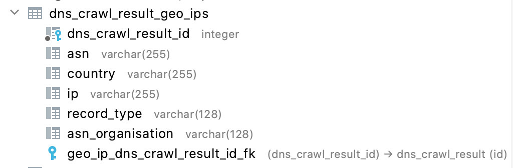

| Column name          | Description                                                                                                                                                                                                               | Example                 |
|----------------------|---------------------------------------------------------------------------------------------------------------------------------------------------------------------------------------------------------------------------|-------------------------|
| dns_crawl_result_id  | Foreign key pointing to dns_crawl_result                                                                                                                                                                                  | 10929666                |
| asn                  | The Autonomous System Number to which the IP address in this row belongs according to MaxMind. [https://en.wikipedia.org/wiki/Autonomous\_system\_(Internet)](https://en.wikipedia.org/wiki/Autonomous_system_(Internet)) | 19551                   |
| country              | The 2-letter country code which, according to MaxMind, corresponds to the IP address                                                                                                                                      | US                      |
| ip                   | An IP address belonging to a dns crawl.                                                                                                                                                                                   | 2a02:e980:8f:0:0:0:0:2a |
| record_type          | The DNS record type for which geoIP location was done. Will always be A or AAA                                                                                                                                            | AAAA                    |
| asn_organisation     | The name of the organization that manages the Autonomous System according to the MaxMind db.                                                                                                                              | INCAPSULA               |

## SMTP crawler

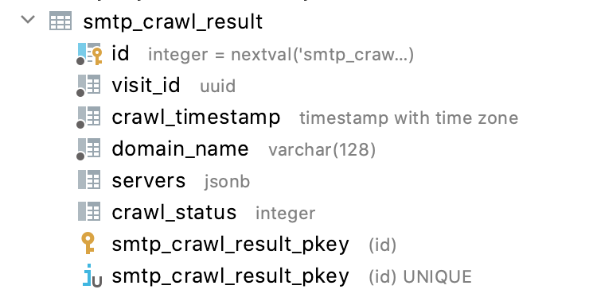

| Column name     | Description                                                                  | Example                              |
|-----------------|------------------------------------------------------------------------------|--------------------------------------|
| id              | primary key                                                                  | 10663036                             |
| visit_id        | Unique id (UUID) per visit. All modules share the same visit_id. primary key | bcd90704-2f51-40e2-9c52-101dceca168e |
| crawl_timestamp | Timestamp when the crawl was performed                                       | 2022-01-07 08:57:21.308303 +00:00    |
| domain_name     | The domain name for which SMTP servers were searched and queried             | dnsbelgium.be                        |
| servers         | JSON with SMTP server information. Details below                             |                                      |
| crawl_status    | The status of the SMTP crawl.                                                | 0                                    |

### SMTP servers

The JSON contains an array of hosts, with the following information for each host:

| Attribuut           | Beschrijving                                                             |
|---------------------|--------------------------------------------------------------------------|
| ip                  | The IP address of the MX host                                            |
| asn                 | The ASN to which the ip belongs                                          |
| country             | Country code                                                             |
| connectOK           | Whether we could connect to the SMTP server at this IP address           |
| ipVersion           | IP version of this IP address (4 or 6)                                   |
| startTlsOk          | Whether START_TLS is supported                                           |
| errorMessage        | Error message when connecting to this SMTP server.                       |
| asnOrganisation     | The organization belonging to the ASN of this IP (according to MaxMind). |
| softwareVersion     | The detected version of the SMTP software.                               |
| connectReplyCode    | The SMTP replyCode after connecting.                                     |
| startTlsReplyCode   | The SMTP replyCode after sending START.                                  |
| supportedExtensions | A list of supported SMTP extensions.                                     |
| hostName            | The hostname.                                                            |
| priority            | The priority of this host according to the MX record.                    |

```json
[
  {
    "hosts": [
      {
        "ip": "104.47.4.36",
        "asn": 8075,
        "banner": "220 AM5EUR02FT017.mail.protection.outlook.com Microsoft ESMTP MAIL Service ready at Fri, 7 Jan 2022 00:05:19 +0000",
        "country": "NL",
        "software": null,
        "connectOK": true,
        "ipVersion": 4,
        "startTlsOk": true,
        "errorMessage": null,
        "asnOrganisation": "MICROSOFT-CORP-MSN-AS-BLOCK",
        "softwareVersion": null,
        "connectReplyCode": 220,
        "connectionTimeMs": 1075,
        "startTlsReplyCode": 220,
        "supportedExtensions": [
          "SMTPUTF8",
          "SIZE 157286400",
          "PIPELINING",
          "AM5EUR02FT017.mail.protection.outlook.com Hello [54.155.99.171]",
          "STARTTLS",
          "8BITMIME",
          "CHUNKING",
          "DSN",
          "ENHANCEDSTATUSCODES",
          "BINARYMIME"
        ]
      },
      {
        "ip": "104.47.6.36",
        "asn": 8075,
        "banner": "220 VE1EUR02FT003.mail.protection.outlook.com Microsoft ESMTP MAIL Service ready at Fri, 7 Jan 2022 00:05:41 +0000",
        "country": "AT",
        "software": null,
        "connectOK": true,
        "ipVersion": 4,
        "startTlsOk": true,
        "errorMessage": null,
        "asnOrganisation": "MICROSOFT-CORP-MSN-AS-BLOCK",
        "softwareVersion": null,
        "connectReplyCode": 220,
        "connectionTimeMs": 1563,
        "startTlsReplyCode": 220,
        "supportedExtensions": [
          "SMTPUTF8",
          "SIZE 157286400",
          "PIPELINING",
          "VE1EUR02FT003.mail.protection.outlook.com Hello [54.155.99.171]",
          "STARTTLS",
          "8BITMIME",
          "CHUNKING",
          "DSN",
          "ENHANCEDSTATUSCODES",
          "BINARYMIME"
        ]
      },
      {
        "ip": "2a01:111:f400:7e06:0:0:0:10",
        "asn": null,
        "banner": null,
        "country": null,
        "software": null,
        "connectOK": false,
        "ipVersion": 6,
        "startTlsOk": false,
        "errorMessage": "conversation with IPv6 SMTP host skipped",
        "asnOrganisation": null,
        "softwareVersion": null,
        "connectReplyCode": 0,
        "connectionTimeMs": -1,
        "startTlsReplyCode": 0,
        "supportedExtensions": []
      },
      {
        "ip": "2a01:111:f400:7e1e:0:0:0:10",
        "asn": null,
        "banner": null,
        "country": null,
        "software": null,
        "connectOK": false,
        "ipVersion": 6,
        "startTlsOk": false,
        "errorMessage": "conversation with IPv6 SMTP host skipped",
        "asnOrganisation": null,
        "softwareVersion": null,
        "connectReplyCode": 0,
        "connectionTimeMs": -1,
        "startTlsReplyCode": 0,
        "supportedExtensions": []
      }
    ],
    "hostName": "dnsbelgium-be.mail.protection.outlook.com",
    "priority": 0
  }
]
```

## SSL crawler

### ssl_crawl_result

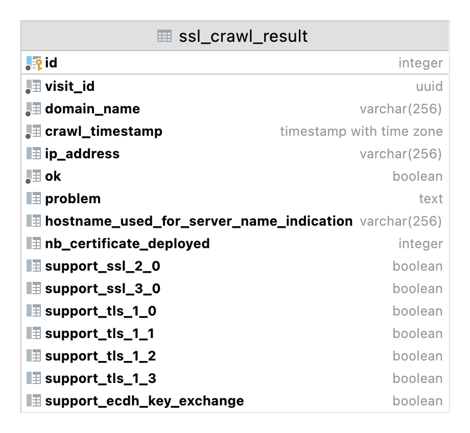

| Column name                              | Description                                                                     | Example                              |
|------------------------------------------|---------------------------------------------------------------------------------|--------------------------------------|
| id                                       | primary key                                                                     | 1749468                              |
| visit_id                                 | Unique id (UUID) per visit. All modules share the same visit_id. primary key    | bcd90704-2f51-40e2-9c52-101dceca168e |
| crawl_timestamp                          | Timestamp when the crawl was performed                                          | 2022-01-07 08:57:24.331958 +00:00    |
| domain_name                              | The domain name                                                                 | dnsbelgium.be                        |
| domain_name                              | The domain name                                                                 | dnsbelgium.be                        |
| ip_address                               | IP address of the host                                                          | 45.60.74.42                          |
| problem                                  | The reason why the scan failed; null if the scan succeeded.                     | null                                 |
| hostname_used_for_server_name_indication | The hostname that has been set within the Server Name Indication TLS extension  | dnsbelgium.be                        |
| nb_certificate_deployed                  | The number of leaf certificates detected by SSLyze.                             | 1                                    |
| support_ssl_2_0                          | Is the SSL 2.0 supported by the server?                                         | false                                |
| support_ssl_3_0                          | Is the SSL 3.0 supported by the server?                                         | false                                |
| support_tls_1_0                          | Is the TLS 1.0 supported by the server?                                         | false                                |
| support_tls_1_1                          | Is the TLS 1.1 supported by the server?                                         | false                                |
| support_tls_1_2                          | Is the TLS 1.2 supported by the server?                                         | true                                 |
| support_tls_1_3                          | Is the TLS 1.3 supported by the server?                                         | true                                 |
| support_ecdh_key_exchange                | True if the server supports at least one cipher suite with an ECDH key exchange | true                                 |

### certificate

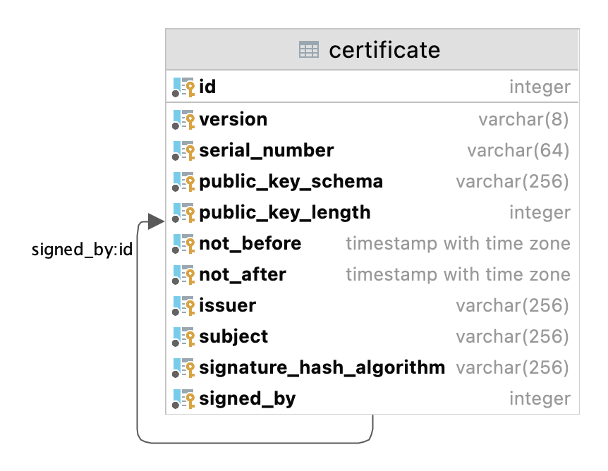

| Column name              | Description                                                                                                                                                                             | Example                                                                                                                                                                                             |
|--------------------------|-----------------------------------------------------------------------------------------------------------------------------------------------------------------------------------------|-----------------------------------------------------------------------------------------------------------------------------------------------------------------------------------------------------|
| version                  | The certificate version. Version 3 certificates are the latest version and also the only type you should see in practice                                                                | v3                                                                                                                                                                                                  |
| serial_number            | The serial number of the certificate as a string                                                                                                                                        | 10290817708216518963613984878                                                                                                                                                                       |
| public_key_schema        | The public key schema used by the certificate. One of RSAPublicKey, DSAPublicKey, EllipticCurvePublicKey, Ed25519PublicKey, Ed448PublicKey, X25519PublicKey or X448PublicKey.           | RSAPublicKey                                                                                                                                                                                        |
| public_key_length        | Bit length of the public key if applicable. If not applicable the value is null. Not applicable for the following: Ed25519PublicKey, Ed448PublicKey, X25519PublicKey and X448PublicKey. | 2048                                                                                                                                                                                                |
| not_before               | A naïve datetime representing the beginning of the validity period for the certificate in UTC. This value is inclusive.                                                                 | 2021-12-16 09:46:13.000000 +00:00                                                                                                                                                                   |
| not_after                | A naïve datetime representing the end of the validity period for the certificate in UTC. This value is inclusive.                                                                       | 2023-01-17 09:46:13.000000 +00:00                                                                                                                                                                   |
| issuer                   | Name of the issuer of the certificate as a [RFC 4514](https://tools.ietf.org/html/rfc4514.html) Distinguished Name.                                                                     | CN=GlobalSign Extended Validation CA - SHA256 - G3,O=GlobalSign nv-sa,C=BE                                                                                                                          |
| subject                  | Name of the subject of the certificate as a [RFC 4514](https://tools.ietf.org/html/rfc4514.html) Distinguished Name.                                                                    | CN=dnsbelgium.be,O=Domaine Name Registration België VZW,STREET=Philipssite 5  bus 13,L=Leuven,ST=Vlaams-Brabant,C=BE,1.3.6.1.4.1.311.60.2.1.3=BE,2.5.4.5=0466.158.640,2.5.4.15=Private Organization |
| signature_hash_algorithm | Hash algorithm used to sign the certificate                                                                                                                                             | sha256                                                                                                                                                                                              |
| sha256_fingerprint       |                                                                                                                                                                                         | 0aa3423012f58713ffcff9aefe875eb308c53305a713128e41d80f3bc45a5aff                                                                                                                                    |
| signed_by_sha256         |                                                                                                                                                                                         | aed5dd9a5339685dfb029f6d89a14335a96512c3cacc52b2994af8b6b37fa4d2                                                                                                                                    |

### certificate_deployment

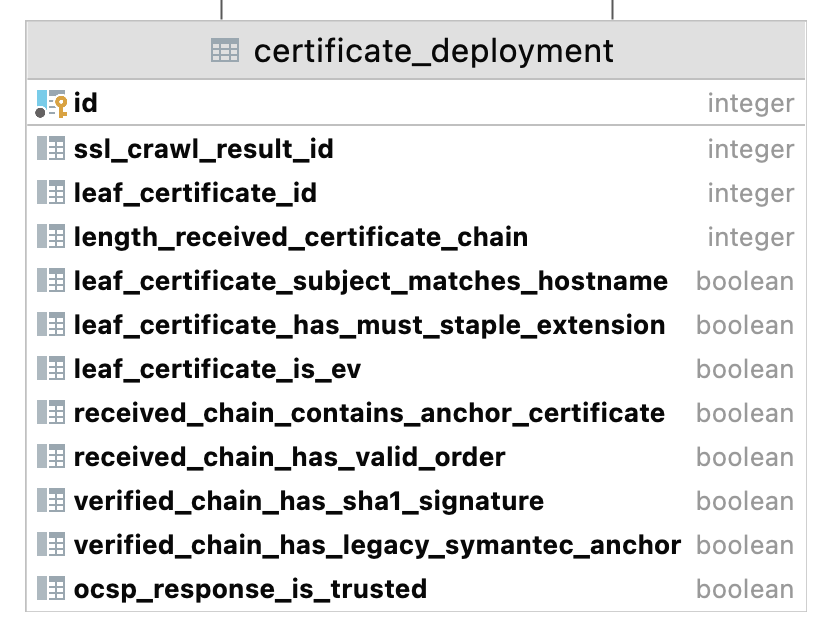

| Column name                                | Description                                                                                                                                                                                                                                                                                                                                 | Example                                                          |
|--------------------------------------------|---------------------------------------------------------------------------------------------------------------------------------------------------------------------------------------------------------------------------------------------------------------------------------------------------------------------------------------------|------------------------------------------------------------------|
| id                                         | primary key                                                                                                                                                                                                                                                                                                                                 | 1041593                                                          |
| ssl_crawl_result_id                        | Reference to the relate ssl_crawl_result                                                                                                                                                                                                                                                                                                    | 1749468                                                          |
| leaf_certificate_sha256                    | Reference to the leaf certificate used for this deployment                                                                                                                                                                                                                                                                                  | 0aa3423012f58713ffcff9aefe875eb308c53305a713128e41d80f3bc45a5aff |
| length_received_certificate_chain          | Length of the certificate chain sent by the server.                                                                                                                                                                                                                                                                                         | 2                                                                |
| leaf_certificate_subject_matches_hostname  | True if the leaf certificate’s Common Name or Subject Alternative Names match the server’s hostname.                                                                                                                                                                                                                                        | true                                                             |
| leaf_certificate_has_must_staple_extension | True if the OCSP must-staple extension is present in the leaf certificate.                                                                                                                                                                                                                                                                  | false                                                            |
| leaf_certificate_is_ev                     | True if the leaf certificate is Extended Validation, according to Mozilla.                                                                                                                                                                                                                                                                  | true                                                             |
| received_chain_contains_anchor_certificate | True if the server included the anchor/root certificate in the chain it sends back to clients. Null if the verified chain could not be built.                                                                                                                                                                                               | false                                                            |
| received_chain_has_valid_order             | True if the certificate chain returned by the server was sent in the right order. Null if any of the certificates in the chain could not be parsed.                                                                                                                                                                                         | true                                                             |
| verified_chain_has_sha1_signature          | True if any of the leaf or intermediate certificates are signed using the SHA-1 algorithm. Null if the verified chain could not be built.                                                                                                                                                                                                   | false                                                            |
| verified_chain_has_legacy_symantec_anchor  | True if the certificate chain contains a distrusted Symantec anchor (([https://blog.qualys.com/ssllabs/2017/09/26/google-and-mozilla-deprecating-existing-symantec-certificates](https://blog.qualys.com/ssllabs/2017/09/26/google-and-mozilla-deprecating-existing-symantec-certificates)). Null if the verified chain could not be built. | false                                                            |
| ocsp_response_is_trusted                   | True if the OCSP response is trusted using the Mozilla trust store. Null if no OCSP response was sent by the server.                                                                                                                                                                                                                        | true                                                             |

### trust_store

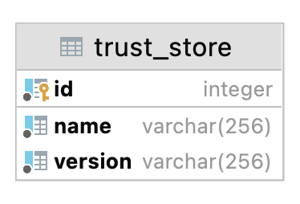

| Column name  | Description                | Example    |
|--------------|----------------------------|------------|
| id           | primary key                | 5          |
| name         | Name of the trust store    | Java       |
| version      | Version of the trust store | jdk-13.0.2 |

### check_against_trust_store

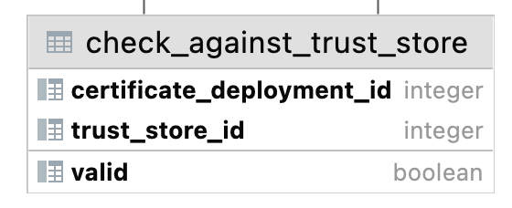

| Column name               | Description                                                                  | Example |
|---------------------------|------------------------------------------------------------------------------|---------|
| certificate_deployment_id | Reference to the related certificate_deployment                              | 1041593 |
| trust_store_id            | Reference to the related trust_store                                         | 3       |
| valid                     | Whether the certificate chain is trusted when using supplied the trust_store | true    |

### curve

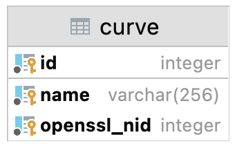

| Column name | Description                                               | Example    |
|-------------|-----------------------------------------------------------|------------|
| id          | primary key                                               | 3          |
| name        | The ANSI X9.62 name if available, otherwise the SECG name | prime256v1 |
| openssl_nid | The OpenSSL NID_XXX value valid for OpenSslEvpPkeyEnum.EC | 415        |

### curve_support

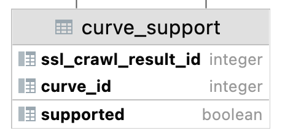

| Column name         | Description                                | Example |
|---------------------|--------------------------------------------|---------|
| ssl_crawl_result_id | Reference to the related ssl_crawl_result. | 5       |
| curve_id            | Reference to the related curve.            | 3       |
| supported           | True if the server accepted the curve      | true    |

### cipher_suite

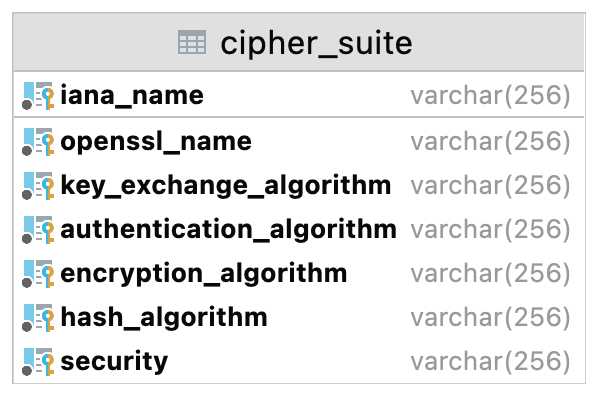

| Column name              | Description                                                                                         | Example                                    |
|--------------------------|-----------------------------------------------------------------------------------------------------|--------------------------------------------|
| iana_name                | Primary key: name attributed by the IANA to the cipher suite.                                       | TLS_ECDHE_RSA_WITH_CAMELLIA_256_CBC_SHA384 |
| openssl_name             | Name given by OpenSSL to the cipher suite (not always unique and not always the same as iana_name). | ECDHE-RSA-CAMELLIA256-SHA384               |
| key_exchange_algorithm   | Algorithm used for the key exchange*                                                                | ECDHE                                      |
| authentication_algorithm | Algorithm used for authenticating the communication*                                                | RSA                                        |
| encryption_algorithm     | Algorithm used for encryption*                                                                      | CAMELLIA 256 CBC                           |
| hash_algorithm           | Algorithm used for hashing*                                                                         | SHA384                                     |
| security                 | Level of security*                                                                                  | weak                                       |

* Those fields might be populated using the API of [https://ciphersuite.info](https://ciphersuite.info)

### cipher_suite_support

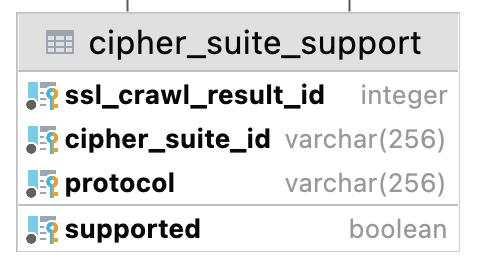


| Column name          | Description                                                                | Example                          |
|----------------------|----------------------------------------------------------------------------|----------------------------------|
| ssl_crawl_result_id  | Reference to the related ssl_crawl_result.                                 | 1749468                          |
| cipher_suite_id      | Reference to the related cipher_suite.                                     | SSL_CK_RC4_128_EXPORT40_WITH_MD5 |
| protocol             | Protocol used with the cipher suite                                        | SSL_2_0                          |
| supported            | True if the server supports the given cipher suite with the given protocol | false                            |

## Feature extraction

Features that were determined based on data retrieved by other modules. Currently only features based on the fetched
HTML.

### html_features


| Column name                            | Example                                                                                                            | Description                                                                                                                                                                                                                                                                                                                                                                                   |
|----------------------------------------|--------------------------------------------------------------------------------------------------------------------|-----------------------------------------------------------------------------------------------------------------------------------------------------------------------------------------------------------------------------------------------------------------------------------------------------------------------------------------------------------------------------------------------|
| id                                     | 7878388                                                                                                            | primary key                                                                                                                                                                                                                                                                                                                                                                                   |
| visit_id                               | bcd90704-2f51-40e2-9c52-101dceca168e                                                                               | unieke id per visit, primary key                                                                                                                                                                                                                                                                                                                                                              |
| domain_name                            | dnsbelgium.be                                                                                                      | De domein naam die werd gecrawld                                                                                                                                                                                                                                                                                                                                                              |
| crawl_timestamp                        | 2022-01-07 08:57:39.456107 +00:00                                                                                  | Tijdstip waarop de features werden bepaald                                                                                                                                                                                                                                                                                                                                                    |
| nb_imgs                                | 4                                                                                                                  | Het aantal  tags die werden gevonden op de bezochte webpagina.                                                                                                                                                                                                                                                                                                                           |
| nb_links_int                           | 96                                                                                                                 | Het aantal interne links op de pagina: het aantal <a> tags waarvan de href start met de url van de pagina die bezocht werd.                                                                                                                                                                                                                                                                   |
| nb_links_ext                           | 7                                                                                                                  | Het aantal externe links op de pagina: het aantal <a> tags waarvan de href start met http maar niet met de url van de pagina die bezocht werd.                                                                                                                                                                                                                                                |
| nb_links_tel                           | 5                                                                                                                  | Het aantal telephone links op de pagina: het aantal <a> tags waarvan de href start met "tel:"                                                                                                                                                                                                                                                                                                 |
| nb_links_email                         | 0                                                                                                                  | Het aantal mailto links op de pagina: het aantal <a> tags waarvan de href start met "mailto:"                                                                                                                                                                                                                                                                                                 |
| nb_input_txt                           | 7                                                                                                                  | Het aantal text input fields op de pagina: <input> tags met type = txt of search                                                                                                                                                                                                                                                                                                              |
| nb_button                              | 3                                                                                                                  | Het aantal buttons op de pagina: <button> tags of <input> tags met type = button of submit                                                                                                                                                                                                                                                                                                    |
| nb_meta_desc                           | 7                                                                                                                  | Het aantal woorden in het content attribuut van een <meta> element met name="description"                                                                                                                                                                                                                                                                                                     |
| nb_meta_keyw                           | 7                                                                                                                  | Het aantal woorden in het content attribuut van een <meta> element met name="keywords"                                                                                                                                                                                                                                                                                                        |
| nb_numerical_strings                   | 105                                                                                                                | Het aantal strings in de pagian die matchen met deze regular expression:   "\\d+(:?[ .,]\\d{3})*(:?[.,]\\d{2})". Expression matches all strings composed of digits, possibly grouped by 3, separated with space dot or comma, ending in dot or comma and two digits                                                                                                                           |
| nb_tags                                | 1005                                                                                                               | Het aantal html elementen op de pagina. (een open en bijhorende close tag tellen uiteraard maar als 1 element)                                                                                                                                                                                                                                                                                |
| nb_words                               | 2502                                                                                                               | Het aantal woorden in body_text. (geteld door te splitsen op whitespace)                                                                                                                                                                                                                                                                                                                      |
| title                                  | Registry for .be, .brussels and .vlaanderen - DNS Belgium                                                          | De titel van de pagina: de inhoud van de <title> element in het <head> element. Ingekort tot maximaal 2000 karakters.                                                                                                                                                                                                                                                                         |
| htmlstruct                             | VSóm+                                                                                                              | A string representation of the HTML structure of the page.. See below. Shortened to a maximum of 2000 characters.                                                                                                                                                                                                                                                                             |
| body_text                              | Hello there now!                                                                                                   | The textual content that would be presented to a visitor of the website. For example, given HTML <p>Hello <b>there</b> now! </p>, would result in  "Hello there now!" as body_text. see https://jsoup.org/apidocs/org/jsoup/nodes/Element.html#text()                                                                                                                                         |
| meta_text                              | DNS Belgium is responsible for the registration and management of all .be, .vlaanderen and .brussels domain names. | De inhoud van het content attribuut van een <meta> tag met name="description" of name="keywords" <meta name="description">                                                                                                                                                                                                                                                                    |
| url                                    | http://www.dnsbelgium.be                                                                                           | De URL die werd bezocht                                                                                                                                                                                                                                                                                                                                                                       |
| title_truncated                        | true                                                                                                               | boolean die aangeeft of het title veld een ingekorte waarde bevat (dus of de oorspronkelijke title langer was dan 2000 karakters)                                                                                                                                                                                                                                                             |
| nb_letters                             | 517                                                                                                                | Het aantal non-whitespace karakters in body_tex                                                                                                                                                                                                                                                                                                                                               |
| nb_distinct_hosts_in_urls              | 14                                                                                                                 | Het aanltal verschillende hosts die werden gevonden in de externe URL's                                                                                                                                                                                                                                                                                                                       |
| external_hosts                         | ["label.anysurfer.be", "twitter.com", "www.facebook.com", "www.wieni.be"]                                          | Een JSON array met alle externe hosts die werden gevonden in de externe URL's  (beperkt tot de eerste 2000 hosts)                                                                                                                                                                                                                                                                             |
| nb_facebook_shallow_links              | 5                                                                                                                  | Number of Facebook links not pointing directly to a specific post, user, page, event.                                                                                                                                                                                                                                                                                                         |
| nb_facebook_deep_links                 | 2                                                                                                                  | Number of Facebook links pointing directly to a specific post, user, page, event.                                                                                                                                                                                                                                                                                                             |
| facebook_links                         | ["https://www.facebook.com/DNSBelgium"]                                                                            | JSON array storing unique links pointing to Facebook found on the page. The list is bounded to a maximum of 10 elements by default.                                                                                                                                                                                                                                                           |
| nb_linkedin_shallow_links              | 6                                                                                                                  | Number of LinkedIn links not pointing to a specific school, company, post or profile                                                                                                                                                                                                                                                                                                          |
| nb_linkedin_deep_links                 | 3                                                                                                                  | Number of LinkedIn links pointing to a specific school, company, post or profile                                                                                                                                                                                                                                                                                                              |
| linkedin_links                         | []                                                                                                                 | JSON array storing unique links pointing to LinkedIn found on the page. The list is bounded to a maximum of 10 elements by default.                                                                                                                                                                                                                                                           |
| nb_twitter_shallow_links               | 2                                                                                                                  | Number of Twitter link not pointing to a specific tweet or user profile                                                                                                                                                                                                                                                                                                                       |
| nb_twitter_deep_links                  | 1                                                                                                                  | Number of Twitter link pointing to a specific tweet or user profile                                                                                                                                                                                                                                                                                                                           |
| twitter_links                          | ["https://twitter.com/dnsbelgium"]                                                                                 | JSON array storing unique links pointing to Twitter found on the page. The list is bounded to a maximum of 10 elements by default.                                                                                                                                                                                                                                                            |
| nb_youtube_shallow_links               | 5                                                                                                                  | Number of YouTube links not pointing directly to a specific user, video or channel.                                                                                                                                                                                                                                                                                                           |
| nb_youtube_deep_links                  | 2                                                                                                                  | Number of YouTube links pointing directly to a specific user, video or channel.                                                                                                                                                                                                                                                                                                               |
| youtube_links                          | []                                                                                                                 | JSON array storing unique links pointing to YouTube found on the page. The list is bounded to a maximum of 10 elements by default.                                                                                                                                                                                                                                                            |
| nb_vimeo_shallow_links                 | 7                                                                                                                  | Number of Vimeo links not pointing directly to a specific user, video, group or channel.                                                                                                                                                                                                                                                                                                      |
| nb_vimeo_deep_links                    | 9                                                                                                                  | Number of Vimeo links pointing directly to a specific user, video, group or channel.                                                                                                                                                                                                                                                                                                          |
| vimeo_links                            | []                                                                                                                 | JSON array storing unique links pointing to Vimeo found on the page. The list is bounded to a maximum of 10 elements by default.                                                                                                                                                                                                                                                              |
| nb_currency_names                      | 5                                                                                                                  | Number of occurrences of currency symbols on the page. If the same currency appears multiple times, it is counted as many times as it appears.                                                                                                                                                                                                                                                |
| nb_distinct_currencies                 | 1                                                                                                                  | Number of distinct currencies on the page: each currency is counted only once. The ISO 4217 and the symbol are considered to be the same currency (EUR and € on the same page only counts for one currency).                                                                                                                                                                                  |
| nb_distinct_words_in_title             | 5                                                                                                                  | Size of the set of the words appearing in the title of the page (in the <title> meta tag). The computation is case insensitive.                                                                                                                                                                                                                                                               |
| distance_title_final_dn                | 49                                                                                                                 | Levenshtein distance between the title of the page (in the <title> meta tag) and the final hostname (after redirection if any). The computation is case insensitive.                                                                                                                                                                                                                          |
| distance_title_initial_dn              | 50                                                                                                                 | Levenshtein distance between the title of the page (in the <title> meta tag) and the initially crawled domain name. The computation is case insensitive.                                                                                                                                                                                                                                      |
| longest_subsequence_title_final_dn     | 11                                                                                                                 | Longest common subsequence between the title of the page (in the <title> meta tag) and the final hostname (after redirection if any). The computation is case insensitive.                                                                                                                                                                                                                    |                                                                                                                                                                                                                    
| longest_subsequence_title_initial_dn   | 10                                                                                                                 | Longest common subsequence between the title of the page (in the <title> meta tag) and the initially crawled domain name. The computation is case insensitive.                                                                                                                                                                                                                                |                                                                                                                                                                                                                                 
| fraction_words_title_final_dn          | 0.375                                                                                                              | Ratio between the number of distinct words in the title of page and the number of words of the title that are also in the final hostname (after redirection if any). For example, with domain-name= "best-shop.be" and title = "The best shop in the world", we have fraction_words_in_dn = 2/5 because there a five distinct words in the title and two of them are also in the domain name. | 
| fraction_words_title_initial_dn        | 0.375                                                                                                              | Ratio between the number of distinct words in the title of page and the number of words of the title that are also in the initially crawled domain name. For example, with domain-name= "best-shop.be" and title = "The best shop in the world", we have fraction_words_in_dn = 2/5 because there a five distinct words in the title and two of them are also in the domain name.             |
| body_text_language                     | en                                                                                                                 | Language of text in the body of the HTML page detected by Lingua from a set of common languages (official EU languages + Arabic, Persian, Japanese and Chinese)                                                                                                                                                                                                                               |
| body_text_language_2                   | en                                                                                                                 | Language of text in the body of the HTML page detected by Lingua from all the spoken languages available in Lingua (74 languages at the time of writing)                                                                                                                                                                                                                                      |

#### HTML struct

Every tag is mapped to a unique character value. For example:

* html => "V"
* head => "S"
* title => "ó"
* body => m p => "+"

So this document:

```html

<html lang="en">
<head>
    <title>Hello world</title>
</head>
<body>
<p>Hi</p>
</body>
</html>
```

will get an htmlstruct of "VSóm+"  regardless of the contents of the <title> or <p> tags.

## Dispatcher

The tables in the dispatcher schema don't contain crawled data. They store state of the crawl operations itself.

### dispatcher_event

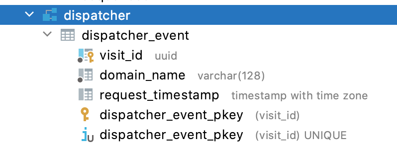

| Column name              | Description                                          | Example                              |
|--------------------------|------------------------------------------------------|--------------------------------------|
| visit_id                 | Primary key                                          | bcd90704-2f51-40e2-9c52-101dceca168e |
| domain_name              | The domain name for which a visit was started.       | dnsbelgium.be                        |
| request_timestamp        | Time when visit request came into the dispatcher     | 2022-01-07 08:57:21.205449 +00:00    |

### dispatcher_event_acks

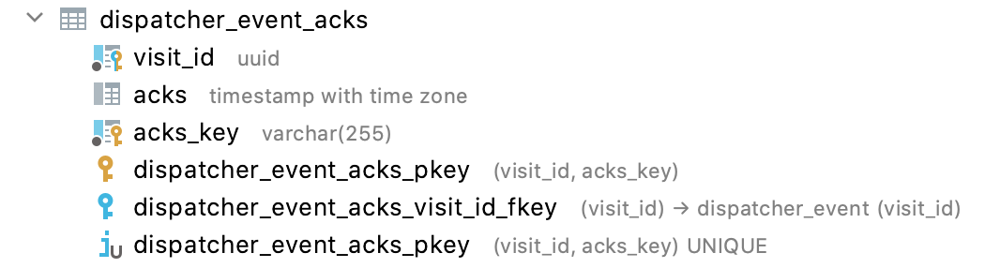

| Column name | Description                                                                                                                                      | Example                              |
|-------------|--------------------------------------------------------------------------------------------------------------------------------------------------|--------------------------------------|
| visit_id    | Primary key                                                                                                                                      | bcd90704-2f51-40e2-9c52-101dceca168e |
| acks        | Time at which a crawler module notified that it had finished a visit.                                                                            | 2022-01-07 08:57:30.944474 +00:00    |
| acks_key    | Reference to the crawler module that informed it was ready with a visit. Possible values are currently: DNS, MUPPETS, WAPPALYZER, SMTP, SSL, VAT | MUPPETS                              |

dispatcher_event_labels
-------------------------

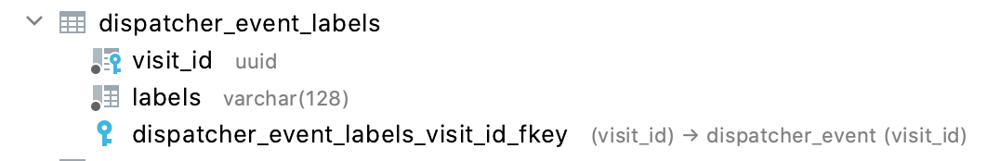

| Column name | Description                                                                                                                                 | Example                              |
|-------------|---------------------------------------------------------------------------------------------------------------------------------------------|--------------------------------------|
| visit_id    | Primary key                                                                                                                                 | bcd90704-2f51-40e2-9c52-101dceca168e |
| labels      | a label belonging to an event. Users of Mercator can give 0 or more labels when they start a visit.                                         | full_crawl_2021-01-07                |
